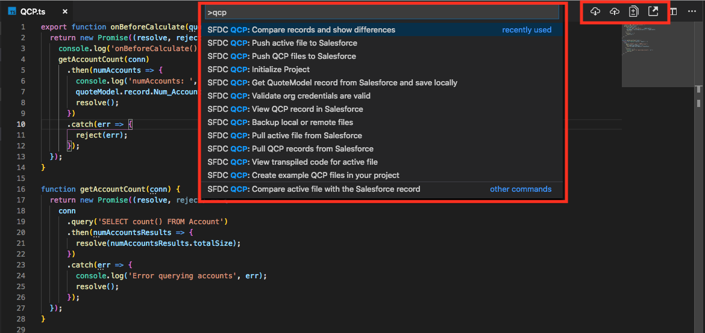

# sfdc-qcp-vscode-extension README

This plugin improves the developer experience when working with [Salesforce QCP Quote Calculator Plugin](https://developer.salesforce.com/docs/atlas.en-us.cpq_dev_plugins.meta/cpq_dev_plugins/cpq_plugins_parent.htm) scripts.

Say goodbye to copy-and-paste, say hello to VSCode!



## Important Details

Locally, all files are saved as Typescript files, but there is no compilation so you will still need to write valid ES6 javascript instead.

The reason for this is because there are may times when someone else changes the remote file or a sandbox is refreshed, it would be nearly
impossible to pull the Javascript from SFDC and then turn that back into TypeScript.

In the future, it would be nice to have a "TypeScript mode" where the developers can truly be in bliss with TypeScript for development,
but that also means that the developer should never pull files down from SFDC, because Salesforce only knows about the JavaScript version of the file.

Your org information is encrypted with a unique key per workspace and is stored as an encrypted value in the `.qcp` directory and the extension creates or updates your `.gitignore` file to ensure this file does not get committed to source control. Even if it is committed to source control it will not work on other computers as the encryption key is stored locally on your computer related to the specific workspace.

## Features

This plugin comes with the following core features:

- Connect to a Salesforce Org
- Create example QCP files in your project as examples
- Pull all existing QCP records from Salesforce
- Pull specific QCP records from Salesforce
- Push all locals files to Salesforce and create or update existing records on Salesforce
- Push active file to Salesforce
- Push specific local file to Salesforce
- Backup local files to directory
- Backup all remote files to directory

### Available Commands

- `SFDC QCP: Validate org credentials`
  - Check if the current credentials are valid
- `SFDC QCP: Initialize Project`
  - Re-authorize or change org credentials
  - Pull all files from Salesforce (if new project)
  - Create example files and pull all (if new project)
- `SFDC QCP: Create example QCP files in your project`
  - Choose one or more examples files to add to your project (this overwrites any existing files with the same name)
- `SFDC QCP: Pull QCP records from Salesforce`
  - Pull all script files from Salesforce (this overwrites existing files with the same name)
- `SFDC QCP: Pull active file from Salesforce`
  - Refreshes the local open file with the version on Salesforce
  - This can also be triggered by clicking the download icon on the top right-hand side of the avtive editor
- `SFDC QCP: Push QCP files to Salesforce`
  - Choose one or more file sto push to Salesforce, which will create or update records in Salesforce
- `SFDC QCP: Push active file to Salesforce`
  - Push active file to Salesforce. If the file has unsaved changes, the file will first be saved
  - This can also be triggered by clicking the upload icon on the top right-hand side of the active editor
- `SFDC QCP: Backup local or remote files`
  - Local
    - This will copy all files from `/src` to a new folder called `/{date}`
  - Remote
    - This will fetch all files from Salesforce and copy to a new folder called `/{date}`
- `SFDC QCP: Compare records and show differences`
  - Compare a local file with a remote record
- `SFDC QCP: Compare active file with the Salesforce record`
  - Compare active local file with a remote record
  - This can also be triggered by clicking the external link icon on the top right-hand side of the active editor
- `SFDC QCP: View transpiled code for active file`
  - Opens the transpiled JavaScript from the active custom script record in Salesforce
- `SFDC QCP: View active QCP record in Salesforce`
  - Automatically logs in to Salesforce and navigated to the active custom script record detail page
  - This can also be triggered by clicking the external link icon on the top right-hand side of the active editor
- `SFDC QCP: Get QuoteModel record from Salesforce and save locally`
  - Shows a dialog to enter Quote Id and saves the QuoteModal as a JSON file in the data folder
  - This served two purposes:
    - Looking at the data for reference when building the QCP
    - Using the quoteModel and it's lineModels in unit tests

### Project Initialization

**To get started, create a blank folder and open it with VSCode.** You can use a folder with existing code if you want to.

Open the command pallette and type in `QCP` and choose `SFDC QCP: Initialize Project`. All other options will be hidden until the project is initialized.

When you initialize a new project, You will be redirected to Salesforce to login using OAuth, and be redirected back to VSCode.
Your authentication information will be stored in this file `.qcp/qcp-config.json`.

A `.gitignore` file will be created if one does not already exist and an entry for `.qcp` will be added to the file to ensure your credentials
are note submitted to source control.

The initialization will also create a `README.md` and `tsconfig.json` if they don't already exist.

Optionally, a `.prettierrc` file will be created during initialization. This can be configured in the extension settings.

Upon initialization, you will be asked if you want to pull all the files from Salesforce and optionally include example files locally.

## Requirements

- Salesforce Developer or Sandbox org.
- The Salesforce CPQ managed package must be installed installed.
- You must configure the CPQ Package level settings to choose which script to enable.

## Writing Unit Tests

When the project is initialized, a `/tests` folder will be created with a `qcp.spec.ts` file that can eb used for unit tests.
**Note**: if you created a project in older versions, you will not have the unit tests in your project. Simply run `SFDC QCP: Initialize Project` and re-authorize the same org and everything will get created again.

The file includes some example unit tests that are commented our, which you will need to uncomment and write the unit tests.

To get started with unit tests, perform the following steps:

1. Ensure you have at least one valid QCP file in the `/src` directory
2. Install the dependencies
   1. Install node if needed
   2. run `npm install` to install the developer dependencies referenced in the `package.json` file
3. Pull down some quote data that you would like to use for testing by running the command `SFDC QCP: Get QuoteModel record from Salesforce and save locally`
   1. Enter a valid quote ID and choose a file name
4. Uncomment the code at the bottom of the unit test file `/tests/qcp.spec.ts` and update the imports
   1. Update the filepath included in the example to point to your QCP file
   2. Replace the `quoteModel` import to point to the name of your downloaded quoteModel JSON file
5. If your QCP uses the `conn` [JSForce](https://jsforce.github.io/) object, then make sure you add valid credentials to the `.env` file

Here is an example of a working QCP and unit test

**/src/QCP.ts**

```typescript
export function onBeforeCalculate(quoteModel, quoteLineModels, conn) {
  return new Promise((resolve, reject) => {
    console.log('onBeforeCalculate()');
    getAccountCount(conn)
      .then(numAccounts => {
        console.log('numAccounts: ', numAccounts);
        quoteModel.record.Num_Accounts__c = numAccounts;
        resolve();
      })
      .catch(err => {
        reject(err);
      });
  });
}

function getAccountCount(conn) {
  return new Promise((resolve, reject) => {
    conn
      .query('SELECT count() FROM Account')
      .then(numAccountsResults => {
        resolve(numAccountsResults.totalSize);
      })
      .catch(err => {
        console.log('Error querying accounts', err);
        resolve();
      });
  });
}
```

**/data/a1j50000006gHK7AAM.json**
_This is a truncated example_

```json
{
  "record": {
    "attributes": {
      "type": "SBQQ__Quote__c",
      "url": "/services/data/v45.0/sobjects/SBQQ__Quote__c/a1j50000006gHK7AAM"
    },
    "Id": "a1j50000006gHK7AAM",
    "Num_Accounts__c": null,
    ...
  "lineItems": [{...}],
  "lineItemGroups": [],
  "isPartial": false,
  "hasMultiSegmentLines": false,
  "customerTotal": 185,
  "currencyDecimalScale": 2,
  "channelDiscountsOffList": false,
  "calculationRequired": false,
  "applyPartnerDiscountFirst": false,
  "applyAdditionalDiscountLast": false
}
```

**/tests/qcp.spec.ts**

```typescript
import { expect } from 'chai';
import * as quoteModel from '../data/a1j50000006gHK7AAM.json';
import * as qcp from '../src/QCP';
import { getConn } from './init-jsforce';

async function initJsforceConn() {
  return await getConn();
}

describe('QCP Test', () => {
  it('Should successfully call onBeforeCalculate()', async () => {
    const conn = await initJsforceConn();
    await qcp.onBeforeCalculate(quoteModel, quoteModel.lineItems, conn);
    const totalSize = (await conn.query('SELECT count() FROM Account')).totalSize;
    expect(quoteModel.record.Num_Accounts__c).to.equal(totalSize);
  });
});
```

## Extension Settings

- `sfdcQcp.pushOnSave` - When a file is saved, show prompt asking if file should be pushed to Salesforce
- `sfdcQcp.prettier` - Determines if a .prettierrc file will be created on project initialization
- `sfdcQcp.saveLog` - Determines if a log file should be saved each time a record from Salesforce is pushed or pulled
- `sfdcQcp.maxLogEntries` - Determines the maximum number of entries in the log file.

## Known Issues

[View issues on GitHub](https://github.com/paustint/sfdc-qcp-vscode-extension/issues).

## Release Notes

Check out my [Medium article](https://medium.com/@paustint/getting-started-with-the-salesforce-cpq-quote-calculator-plugin-vscode-extension-718306ff40d4) on using the extension.

See changes in Changelog.

## Contributing

Contributions of all kinds will be considered. https://github.com/paustint/sfdc-qcp-vscode-extension
